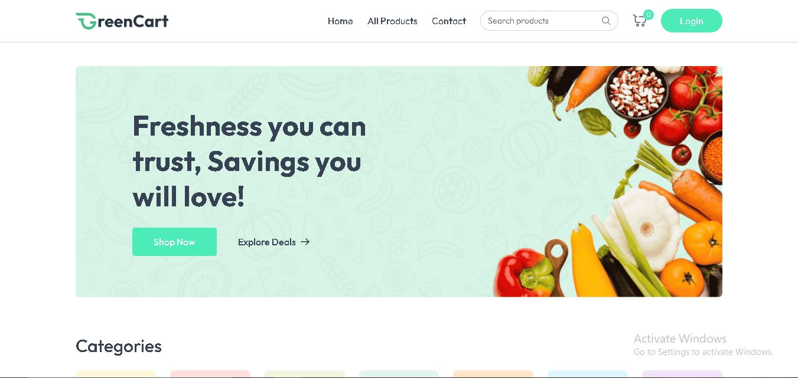
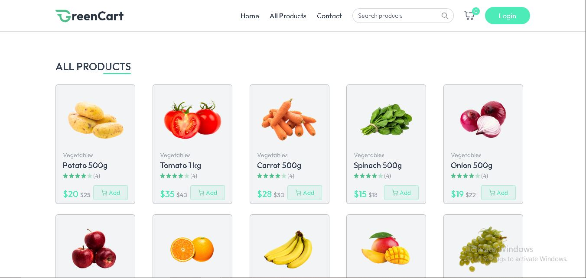
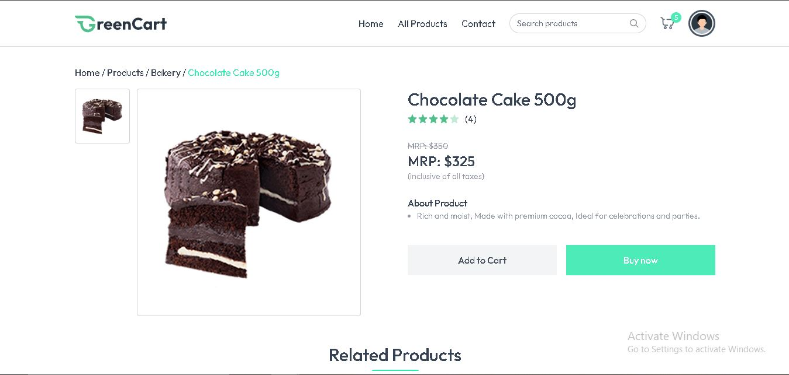
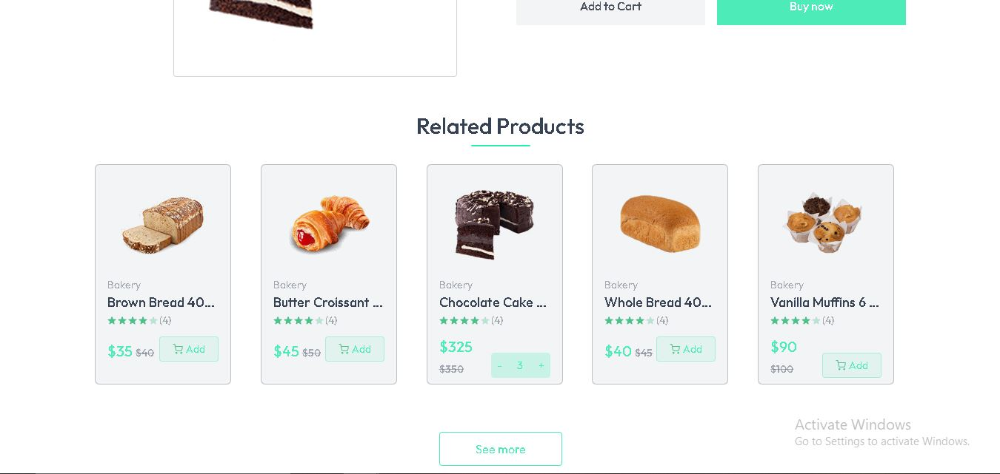
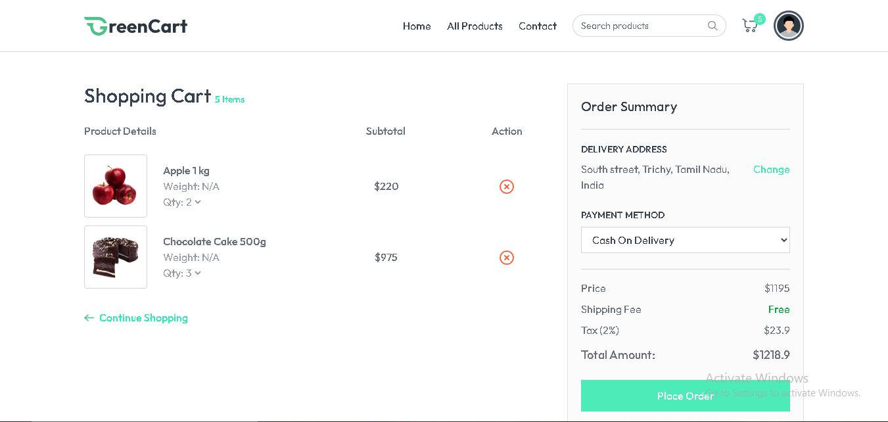
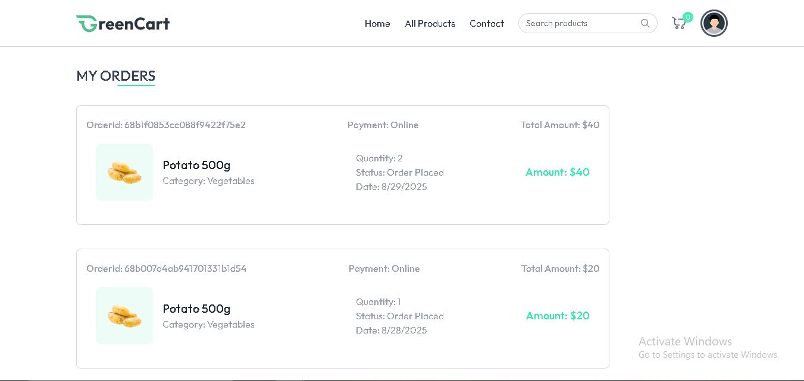
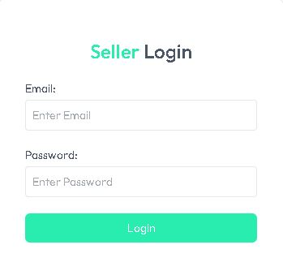
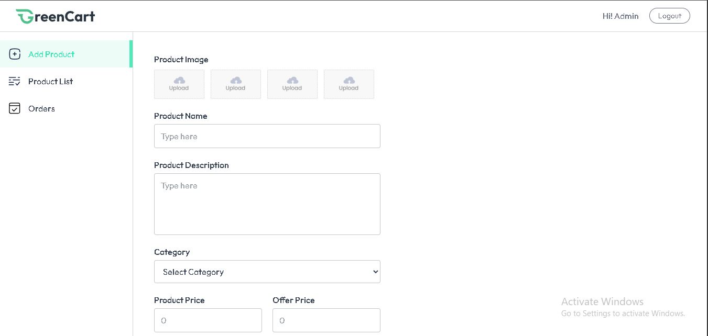
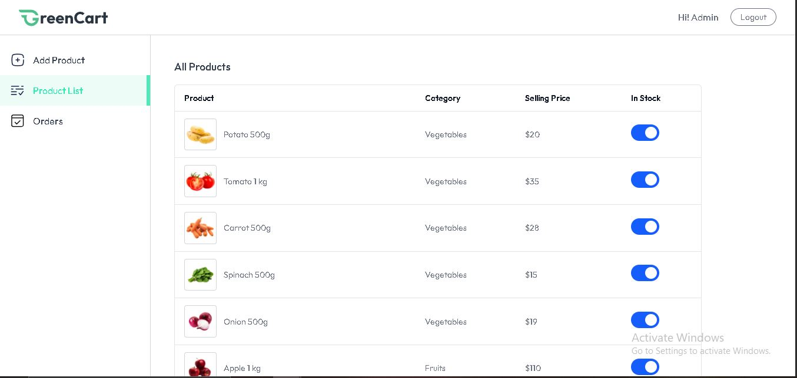
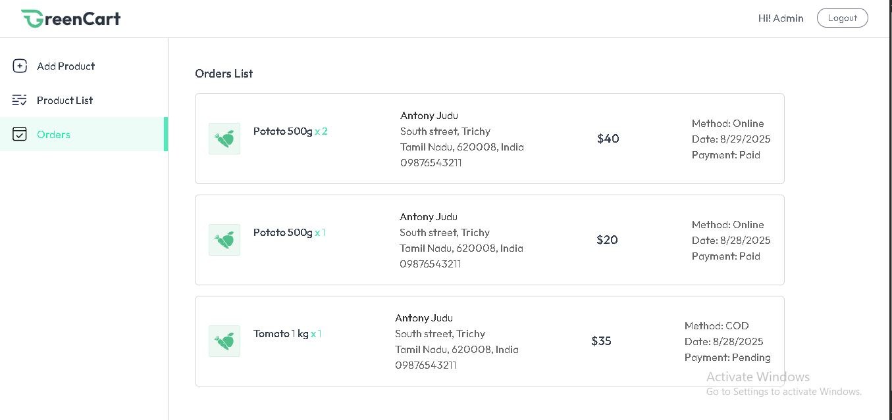

````markdown
# 🛒 GreenCart – Online Grocery Store

GreenCart is a **full-stack MERN (MongoDB, Express, React, Node.js)** online grocery store application.

Users can browse grocery products, manage their shopping cart, save delivery addresses, and place orders using **Cash on Delivery (COD)** or **Stripe Online Payments**.

The application also provides a **Seller/Admin Dashboard** where the seller can add, edit, and delete products and view customer orders.

---

## 🌐 Live Demo

### 👤 User / Customer Website

[https://greencart-frontend-xld9.onrender.com/](https://greencart-frontend-xld9.onrender.com/)

### 🛍️ Seller / Admin Dashboard

[https://greencart-frontend-xld9.onrender.com/seller](https://greencart-frontend-xld9.onrender.com/seller)

### ⚙️ Backend API

[https://greencart-backend-72un.onrender.com](https://greencart-backend-72un.onrender.com)

---

## 🔑 Seller / Admin Login

### Seller Login

[https://greencart-frontend-xld9.onrender.com/seller](https://greencart-frontend-xld9.onrender.com/seller)

**Email:**

```text
admin@example.com
````

**Password:**

```text
greatstack123
```

> These credentials are provided for demo/testing purposes.

---

## ✨ Features

### 👤 User Features

* User registration and login
* JWT authentication using cookies
* Browse grocery products
* Browse products by category
* Product details
* Related products
* Add products to cart
* Increase/decrease product quantity
* Remove products from cart
* Save delivery addresses
* Cash on Delivery (COD)
* Stripe online payment
* Stripe webhook payment updates
* View order history
* View payment status

### 🛍️ Seller/Admin Features

* Seller/Admin login
* Secure seller authentication
* Seller dashboard
* Add products
* Edit products
* Delete products
* Upload product images
* Cloudinary image storage
* View product list
* View customer orders
* View order/payment status

---

## 🛠️ Tech Stack

| Layer          | Technology          |
| -------------- | ------------------- |
| Frontend       | React.js, Vite      |
| Styling        | Tailwind CSS        |
| Backend        | Node.js, Express.js |
| Database       | MongoDB Atlas       |
| ODM            | Mongoose            |
| Authentication | JWT + HTTP Cookies  |
| Image Storage  | Cloudinary          |
| Payment        | Stripe              |
| HTTP Client    | Axios               |
| Notifications  | React Hot Toast     |
| Routing        | React Router        |
| Hosting        | Render              |

---

## 📁 Project Structure

```text
greencart-main/
│
├── client/
│   ├── src/
│   │   ├── assets/
│   │   ├── components/
│   │   │   ├── seller/
│   │   │   └── ...
│   │   ├── context/
│   │   ├── pages/
│   │   │   ├── seller/
│   │   │   └── ...
│   │   ├── App.jsx
│   │   ├── main.jsx
│   │   └── index.css
│   │
│   ├── .env
│   ├── index.html
│   ├── package.json
│   └── vite.config.js
│
├── server/
│   ├── configs/
│   ├── controllers/
│   ├── middleware/
│   ├── models/
│   ├── routes/
│   ├── .env
│   ├── package.json
│   └── server.js
│
└── README.md
```

---

## 🔐 Environment Variables

### Frontend `.env`

```env
VITE_BACKEND_URL=http://localhost:8000
VITE_CURRENCY='$'
```

### Production Frontend

```env
VITE_BACKEND_URL=https://greencart-backend-72un.onrender.com
VITE_CURRENCY='$'
```

### Backend `.env`

```env
PORT=8000

MONGODB_URI=your_mongodb_connection_string

JWT_SECRET=your_jwt_secret

SELLER_EMAIL=your_seller_email
SELLER_PASSWORD=your_seller_password

CLOUDINARY_CLOUD_NAME=your_cloudinary_cloud_name
CLOUDINARY_API_KEY=your_cloudinary_api_key
CLOUDINARY_API_SECRET=your_cloudinary_api_secret

STRIPE_SECRET_KEY=your_stripe_secret_key
STRIPE_WEBHOOK_SECRET=your_stripe_webhook_secret
```

> ⚠️ Never commit `.env` files containing real passwords, API keys, database credentials, or secrets to GitHub.

---

## 🚀 Run Project Locally

### 1. Clone Repository

```bash
git clone https://github.com/shubhamshrivastav1/greencart-main.git
```

```bash
cd greencart-main
```

### 2. Backend Setup

```bash
cd server
```

Install dependencies:

```bash
npm install
```

Create a `.env` file and add the required environment variables.

Start the backend:

```bash
npm run server
```

Backend:

```text
http://localhost:8000
```

### 3. Frontend Setup

Open another terminal:

```bash
cd client
```

Install dependencies:

```bash
npm install
```

Create `.env`:

```env
VITE_BACKEND_URL=http://localhost:8000
VITE_CURRENCY='$'
```

Start frontend:

```bash
npm run dev
```

Frontend:

```text
http://localhost:5173/
```

---

## 🔗 Local URLs

### User Website

```text
http://localhost:5173/
```

### Seller/Admin Website

```text
http://localhost:5173/seller
```

### Backend API

```text
http://localhost:8000
```

---

## 🔒 Authentication

GreenCart uses **JWT-based authentication with HTTP-only cookies**.

### User Authentication

Users can:

* Register
* Login
* Logout
* Check authentication status

### Seller Authentication

Seller authentication uses:

* JWT
* HTTP-only cookies
* Environment variables for seller credentials
* Seller authentication middleware

Protected seller routes verify the `sellerToken` cookie before allowing access.

---

## 🖼️ Image Management

Product images are uploaded and stored using **Cloudinary**.

The application uses Cloudinary instead of storing product images directly on the backend server.

---

## 📦 Order Flow

```text
User
  ↓
Browse Products
  ↓
Add to Cart
  ↓
Add Delivery Address
  ↓
Checkout
  ↓
COD / Stripe Payment
  ↓
Order Created
  ↓
Seller Views Order
```

---

## 💳 Stripe Payment Flow

```text
User
  ↓
Checkout
  ↓
Stripe Checkout
  ↓
Payment
  ↓
Stripe Webhook
  ↓
Backend
  ↓
Update Order Payment Status
```

---

## 📸 Screenshots

### 👤 User Side

#### Home Page



#### All Products



#### Product Details



#### Related Products



#### Cart



#### Sign Up


#### Login


#### My Orders



---

### 🛍️ Seller/Admin Side

#### Seller Login



#### Seller Dashboard



#### Seller Product List



#### Seller Orders



---

## ☁️ Deployment

The application is deployed on **Render**.

### Frontend

[https://greencart-frontend-xld9.onrender.com/](https://greencart-frontend-xld9.onrender.com/)

### Seller/Admin

[https://greencart-frontend-xld9.onrender.com/seller](https://greencart-frontend-xld9.onrender.com/seller)

### Backend

[https://greencart-backend-72un.onrender.com](https://greencart-backend-72un.onrender.com)

---

## 🔮 Future Improvements

* Product search
* Product reviews and ratings
* Wishlist
* Coupon and discount system
* Order tracking
* Sales analytics
* Revenue dashboard
* Stock notifications
* Multiple seller accounts

---

## 📄 License

This project is licensed under the MIT License.

---

## 👨‍💻 Author

### Shubham Shrivastav

GitHub:

[https://github.com/shubhamshrivastav1](https://github.com/shubhamshrivastav1)

---

## ⭐ Support

If you like this project, please give it a ⭐ on GitHub.

```
```
